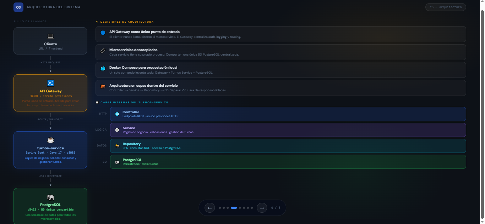

# Actividades — Semana 2, Sesión 1
## Sistemas Distribuidos — Definición del Proyecto

---

| Campo | Detalle |
|---|---|
| **Estudiante** | Nicolás Álvarez |
| **Asignatura** | Sistemas Distribuidos |
| **Institución** | CORHUILA |
| **Semana** | Semana 2, Sesión 1 — Definición del Proyecto |

---

## Actividad 1 — User Stories

Las historias están distribuidas entre los tres microservicios del sistema: `user-service`, `turno-service` y `notification-service`.

---

### HU-01 — Registro de usuario
**Microservicio:** user-service | **Prioridad:** Must Have | **Story Points:** 3

> Como **visitante**, quiero **registrarme con mi nombre, correo y contraseña**, para **acceder al sistema y agendar citas**.

**Criterios de Aceptación:**
- [ ] El formulario valida que el correo tenga formato correcto
- [ ] La contraseña debe tener mínimo 8 caracteres
- [ ] No se permiten correos duplicados (responde HTTP 409)
- [ ] El sistema retorna un token JWT al registrarse exitosamente
- [ ] El rol por defecto asignado es CLIENTE

---

### HU-02 — Inicio de sesión
**Microservicio:** user-service | **Prioridad:** Must Have | **Story Points:** 2

> Como **usuario registrado**, quiero **iniciar sesión con mi correo y contraseña**, para **acceder a mis funciones según mi rol**.

**Criterios de Aceptación:**
- [ ] El sistema valida credenciales correctas y retorna JWT
- [ ] Si las credenciales son incorrectas responde HTTP 401
- [ ] El token contiene el rol del usuario (CLIENTE, PROFESIONAL, ADMINISTRADOR)

---

### HU-03 — Gestión de perfil
**Microservicio:** user-service | **Prioridad:** Should Have | **Story Points:** 2

> Como **cliente**, quiero **actualizar mis datos personales como nombre y teléfono**, para **mantener mi información de contacto actualizada**.

**Criterios de Aceptación:**
- [ ] El cliente puede editar nombre y teléfono
- [ ] No se puede modificar el correo ni el rol
- [ ] Los cambios se reflejan inmediatamente en el sistema

---

### HU-04 — Agendar una cita
**Microservicio:** turno-service | **Prioridad:** Must Have | **Story Points:** 5

> Como **cliente**, quiero **seleccionar un profesional, fecha y hora disponible para agendar una cita**, para **reservar mi turno sin llamar por teléfono**.

**Criterios de Aceptación:**
- [ ] El cliente puede ver los profesionales disponibles
- [ ] Solo se muestran horarios disponibles (no ocupados)
- [ ] El sistema confirma la cita y la registra con estado PENDIENTE
- [ ] No se pueden agendar dos citas en el mismo horario con el mismo profesional

---

### HU-05 — Cancelar una cita
**Microservicio:** turno-service | **Prioridad:** Must Have | **Story Points:** 3

> Como **cliente**, quiero **cancelar una cita agendada**, para **liberar el turno si ya no puedo asistir**.

**Criterios de Aceptación:**
- [ ] El cliente solo puede cancelar sus propias citas
- [ ] Solo se pueden cancelar citas con estado PENDIENTE
- [ ] Al cancelar, el horario queda disponible nuevamente
- [ ] La cita cambia de estado a CANCELADA

---

### HU-06 — Ver historial de citas
**Microservicio:** turno-service | **Prioridad:** Should Have | **Story Points:** 2

> Como **cliente**, quiero **ver el historial de mis citas anteriores y próximas**, para **hacer seguimiento de mis visitas**.

**Criterios de Aceptación:**
- [ ] El cliente ve todas sus citas ordenadas por fecha
- [ ] Cada cita muestra: profesional, fecha, hora y estado
- [ ] Se puede filtrar por estado (PENDIENTE, COMPLETADA, CANCELADA)

---

### HU-07 — Gestionar disponibilidad
**Microservicio:** turno-service | **Prioridad:** Must Have | **Story Points:** 5

> Como **profesional**, quiero **registrar mis horarios disponibles por día y hora**, para **que los clientes solo puedan agendar en mis horas libres**.

**Criterios de Aceptación:**
- [ ] El profesional puede definir su disponibilidad por día de la semana
- [ ] Puede bloquear horarios específicos (vacaciones, descanso)
- [ ] Los cambios de disponibilidad se reflejan inmediatamente en el agendamiento

---

### HU-08 — Ver citas del día
**Microservicio:** turno-service | **Prioridad:** Should Have | **Story Points:** 2

> Como **profesional**, quiero **ver todas las citas agendadas para el día actual**, para **organizarme y prepararme con anticipación**.

**Criterios de Aceptación:**
- [ ] El profesional ve solo sus propias citas del día
- [ ] Cada cita muestra: nombre del cliente, hora y estado
- [ ] Las citas están ordenadas cronológicamente

---

### HU-09 — Notificación de confirmación de cita
**Microservicio:** notification-service | **Prioridad:** Must Have | **Story Points:** 3

> Como **cliente**, quiero **recibir una notificación al agendar una cita**, para **tener confirmación de que mi turno quedó registrado**.

**Criterios de Aceptación:**
- [ ] Al agendar, el sistema envía una notificación al cliente
- [ ] La notificación incluye: profesional, fecha, hora y lugar
- [ ] La notificación se registra en el sistema con estado ENVIADA

---

### HU-10 — Recordatorio de cita próxima
**Microservicio:** notification-service | **Prioridad:** Should Have | **Story Points:** 3

> Como **cliente**, quiero **recibir un recordatorio antes de mi cita**, para **no olvidar asistir a mi turno**.

**Criterios de Aceptación:**
- [ ] El sistema envía recordatorio 24 horas antes de la cita
- [ ] El recordatorio incluye: profesional, fecha y hora
- [ ] Si la cita fue cancelada no se envía el recordatorio

---

### Resumen de Priorización MoSCoW

| Prioridad | User Stories | Total |
|---|---|---|
| Must Have | HU-01, HU-02, HU-04, HU-05, HU-07, HU-09 | 6 |
| Should Have | HU-03, HU-06, HU-08, HU-10 | 4 |
| Could Have | — | 0 |
| Won't Have | — | 0 |

### Distribución por Microservicio

| Microservicio | User Stories |
|---|---|
| user-service | HU-01, HU-02, HU-03 |
| turno-service | HU-04, HU-05, HU-06, HU-07, HU-08 |
| notification-service | HU-09, HU-10 |

---

## Actividad 2 — Diagrama de Arquitectura

La arquitectura inicial del sistema para Release 1 está compuesta por un API Gateway y tres microservicios, cada uno con su propia base de datos.

```
Cliente (Postman / Navegador)
            |
            | HTTP
            ▼
  ┌─────────────────────┐
  │      API Gateway    │  Spring Cloud Gateway (:8080)
  └──────────┬──────────┘
             |
    ┌────────┼────────────┐
    |        |            |
    ▼        ▼            ▼
┌────────┐ ┌──────────┐ ┌──────────────────┐
│  user  │ │  turno   │ │  notification    │
│service │ │ service  │ │     service      │
│ :8081  │ │  :8082   │ │      :8083       │
└───┬────┘ └────┬─────┘ └────────┬─────────┘
    |           |                |
    ▼           ▼                ▼
┌──────────┐ ┌──────────┐ ┌──────────┐
│PostgreSQL│ │PostgreSQL│ │PostgreSQL│
│  :5432   │ │  :5433   │ │  :5434   │
└──────────┘ └──────────┘ └──────────┘
```

**Comunicación:** Los microservicios se comunican de forma síncrona (HTTP/REST) a través del API Gateway en Release 1. En Release 2 se incorporará comunicación asíncrona con RabbitMQ entre turno-service y notification-service.

### Captura — Diagrama de Arquitectura




---

## Actividad 3 — Configurar GitHub Project

El Tech Lead (Yeison Scarpeta) configuró el GitHub Project tipo Kanban en el repositorio del proyecto con las siguientes columnas:

| Columna | Propósito |
|---|---|
| Backlog | Todas las historias pendientes de planificar |
| To Do | Historias planificadas para el sprint actual |
| In Progress | Historias en desarrollo |
| In Review | Historias en revisión o Pull Request abierto |
| Done | Historias completadas y mergeadas |

### Issues creados (User Stories más importantes)

| Issue | User Story | Label | Milestone |
|---|---|---|---|
| #1 | HU-01 Registro de usuario | priority:high, service:user | Release 1 — MVP |
| #2 | HU-02 Inicio de sesión | priority:high, service:user | Release 1 — MVP |
| #3 | HU-04 Agendar una cita | priority:high, service:turno | Release 1 — MVP |
| #4 | HU-05 Cancelar una cita | priority:high, service:turno | Release 1 — MVP |
| #5 | HU-09 Notificación de confirmación | priority:high, service:notification | Release 1 — MVP |

### Milestone configurado

**Release 1 — MVP** — Incluye todas las historias Must Have del backlog.

### Tablero Kanban

El tablero se configura con las siguientes columnas en GitHub Projects:

```
Backlog > To Do > In Progress > In Review > Done
```

Cada User Story se crea como un Issue y se arrastra entre columnas según su estado de desarrollo. Las historias Must Have se ubican inicialmente en To Do para el Sprint 1.

### Issues configurados en el repositorio

Los 5 issues principales se crean en la pestaña Issues del repositorio con el siguiente formato de título y se asignan al Milestone Release 1 — MVP:

```
#1 — HU-01: Registro de usuario         → Labels: priority:high, service:user
#2 — HU-02: Inicio de sesión            → Labels: priority:high, service:user
#3 — HU-04: Agendar una cita            → Labels: priority:high, service:turno
#4 — HU-05: Cancelar una cita           → Labels: priority:high, service:turno
#5 — HU-09: Notificación de confirmación → Labels: priority:high, service:notification
```

### Milestone Release 1 — MVP

El Milestone agrupa todas las historias Must Have del backlog. Se crea desde la pestaña Issues → Milestones con el título `Release 1 — MVP` y cada issue queda vinculado a él desde su panel de configuración.

---

## Referencias

- Cohn, M. (2004). *User Stories Applied: For Agile Software Development*. Addison-Wesley.
- Material de clase — Semana 2, Sesión 1: Definición del Proyecto. CORHUILA.
