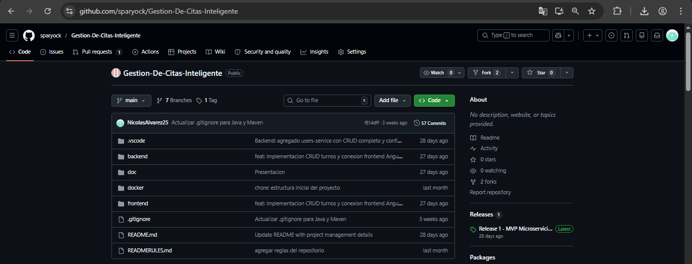
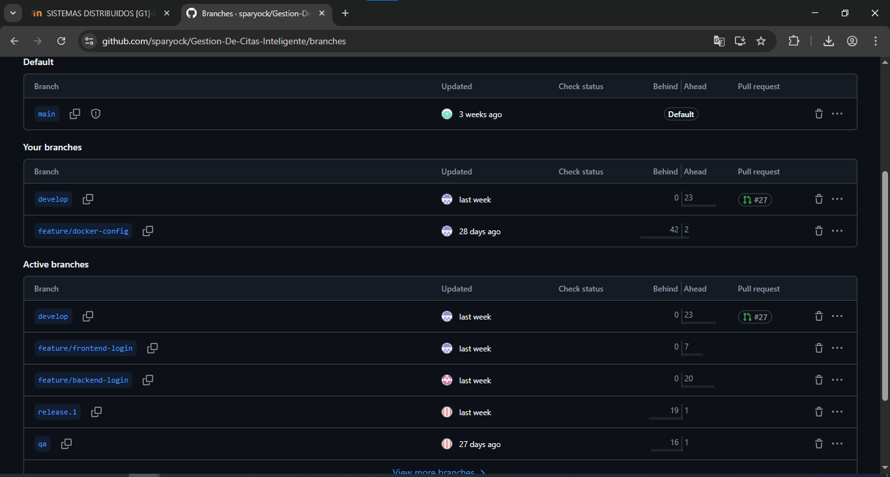

# Actividades — Semana 3, Sesión 1
## Sistemas Distribuidos — Setup del Repositorio y Ambientes

---

| Campo | Detalle |
|---|---|
| **Estudiante** | Nicolás Álvarez |
| **Asignatura** | Sistemas Distribuidos |
| **Institución** | CORHUILA |
| **Semana** | Semana 3, Sesión 1 — Setup del Repositorio y Ambientes |

---

## Actividad 1 — Configurar el Monorepo

El repositorio del proyecto **Gestión de Citas Inteligente** ya está configurado como monorepo en GitHub. La estructura de carpetas fue creada por el Tech Lead (Yeison Scarpeta) y contiene todos los módulos del sistema organizados de la siguiente manera:

**Repositorio:** [https://github.com/sparyock/Gestion-De-Citas-Inteligente](https://github.com/sparyock/Gestion-De-Citas-Inteligente)

### Estructura actual del monorepo

```
Gestion-De-Citas-Inteligente/
├── .github/
│   └── workflows/              # GitHub Actions (CI/CD)
├── .vscode/                    # Configuración del editor
├── backend/
│   ├── api-gateway/            # Spring Cloud Gateway (:8080)
│   └── user-service/           # Microservicio usuarios (:8081)
├── doc/                        # Documentación técnica
├── docker/                     # docker-compose.yml
├── frontend/                   # Angular (microfrontend - Release 2)
├── .gitignore
├── README.md
└── READMERULES.md
```

### Decisión: Monorepo

Se eligió la estrategia **Monorepo** por las siguientes razones:

| Razón | Justificación |
|---|---|
| Equipo pequeño (4 personas) | Un solo repositorio facilita la coordinación |
| Un solo GitHub Project | Todo el seguimiento de tareas en un lugar |
| Docker Compose compartido | Un solo archivo orquesta todos los servicios |
| CI/CD centralizado | Un pipeline verifica todo el sistema |

### .gitignore configurado

El archivo `.gitignore` del repositorio excluye los siguientes elementos para evitar subir archivos innecesarios o sensibles:

```
# Java / Maven
target/
*.class
*.jar
*.war
*.log

# Spring Boot
application-local.yml
application-secret.yml

# IDE
.idea/
*.iml
.vscode/
*.swp

# Node / Angular
node_modules/
dist/
.angular/

# Docker
.env
docker-compose.override.yml

# OS
.DS_Store
Thumbs.db
```

### Captura — Estructura del repositorio en GitHub




---

## Actividad 2 — Configurar Ramas y Protecciones

Las tres ramas principales del proyecto ya están creadas y configuradas en el repositorio.

### Ramas configuradas

| Rama | Propósito | Estabilidad |
|---|---|---|
| `main` | Producción — código estable y probado | Siempre estable |
| `qa` | Testing y validación antes de producción | Se espera estable |
| `develop` | Integración de desarrollo activo | Puede tener bugs |

### Flujo de trabajo entre ramas

```
feature/SD-001-nombre
        |
        | Pull Request
        ▼
     develop
        |
        | Pull Request
        ▼
        qa
        |
        | Pull Request
        ▼
       main
```

### Branch Protection Rules en main

La rama `main` está protegida con las siguientes reglas configuradas desde Settings → Branches → Branch protection rules:

- Require pull request before merging
- Require at least 1 approval before merging
- Require status checks to pass before merging
- No se permite push directo a `main`

### Convención de nombres de ramas

| Tipo | Formato | Ejemplo |
|---|---|---|
| Feature | `feature/SD-[ID]-[descripcion]` | `feature/SD-001-user-registration` |
| Bugfix | `bugfix/SD-[ID]-[descripcion]` | `bugfix/SD-015-fix-login-validation` |
| Hotfix | `hotfix/SD-[ID]-[descripcion]` | `hotfix/SD-020-fix-gateway-crash` |

### Captura — Ramas del repositorio




---

## Actividad 3 — Primer GitHub Action

Se creó el archivo de workflow de integración continua en `.github/workflows/ci.yml`. Este archivo define el pipeline que se ejecuta automáticamente cada vez que se hace push o se abre un Pull Request hacia `develop`, `qa` o `main`.

### Archivo `.github/workflows/ci.yml`

```yaml
name: CI Pipeline

on:
  push:
    branches: [ develop, qa, main ]
  pull_request:
    branches: [ develop, qa, main ]

jobs:
  build:
    runs-on: ubuntu-latest

    steps:
    - name: Checkout código
      uses: actions/checkout@v4

    - name: Setup Java 17
      uses: actions/setup-java@v4
      with:
        java-version: '17'
        distribution: 'temurin'

    - name: Build user-service
      run: |
        cd backend/user-service
        mvn clean compile

    - name: Run tests
      run: |
        cd backend/user-service
        mvn test

    - name: Build api-gateway
      run: |
        cd backend/api-gateway
        mvn clean compile

    - name: Build verificado
      run: echo "Build y tests exitosos"
```

### Qué hace cada paso del workflow

| Paso | Descripción |
|---|---|
| `Checkout código` | Descarga el código del repositorio en el servidor de GitHub |
| `Setup Java 17` | Instala Java 17 en el servidor para poder compilar |
| `Build user-service` | Compila el microservicio de usuarios |
| `Run tests` | Ejecuta los tests unitarios del user-service |
| `Build api-gateway` | Compila el API Gateway |
| `Build verificado` | Confirma que todo el proceso fue exitoso |

### Cómo verificar que el Action funciona

Al hacer push a `develop` o abrir un Pull Request, GitHub ejecuta automáticamente el workflow. El resultado se puede ver en la pestaña **Actions** del repositorio. Si el pipeline pasa, aparece una marca verde. Si falla, aparece una marca roja con el detalle del error.

### Verificación del workflow

Al hacer push a `develop` o abrir un Pull Request, GitHub ejecuta el pipeline automáticamente. El proceso es el siguiente:

1. GitHub detecta el push y activa el workflow definido en `ci.yml`
2. Crea un servidor temporal con Ubuntu para ejecutar los pasos
3. Descarga el código, instala Java 17 y compila cada microservicio en orden
4. Si todos los pasos pasan, el workflow muestra estado **success** en verde
5. Si algún paso falla, muestra estado **failure** en rojo con el detalle del error

El resultado es visible en la pestaña **Actions** del repositorio y también aparece como indicador de estado en cada Pull Request, lo que impide mergear código que no compile correctamente.

---

## Referencias

- Chacon, S. & Straub, B. (2014). *Pro Git*. Apress.
- GitHub Docs. (2024). *GitHub Actions documentation*. https://docs.github.com/en/actions
- Material de clase — Semana 3, Sesión 1: Setup del Repositorio y Ambientes. CORHUILA.
