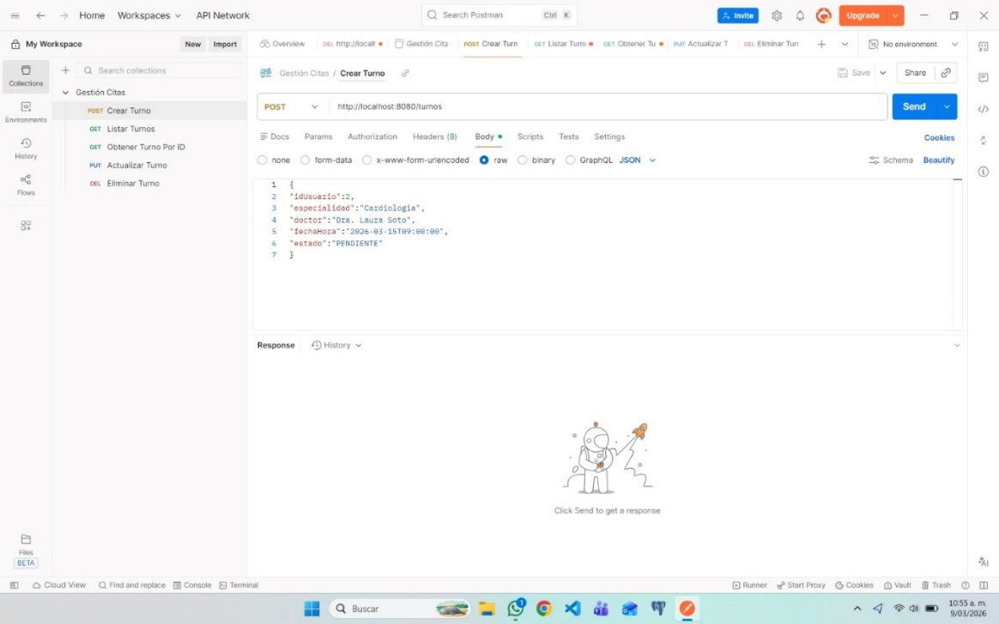
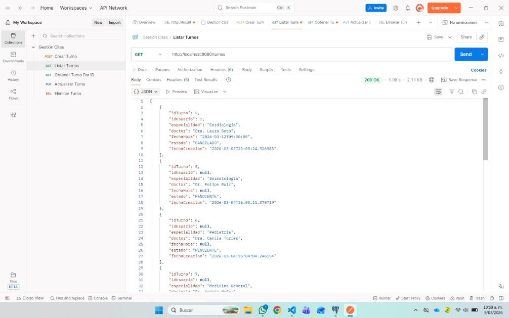

# Actividades — Semana 3, Sesión 2
## Sistemas Distribuidos — API Gateway, Service Discovery y REST APIs

---

| Campo | Detalle |
|---|---|
| **Estudiante** | Nicolás Álvarez |
| **Asignatura** | Sistemas Distribuidos |
| **Institución** | CORHUILA |
| **Semana** | Semana 3, Sesión 2 — API Gateway, Service Discovery y REST APIs |

---

## Actividad 1 — Diseñar la API del Proyecto

Se diseñaron los endpoints REST del microservicio principal del proyecto: **user-service**. Este microservicio gestiona el registro, autenticación y administración de usuarios del sistema de citas.

**URL base:** `http://localhost:8080/api/v1/users` (a través del API Gateway)

---

### GET /api/v1/users — Listar todos los usuarios

**Request:**
```
GET http://localhost:8080/api/v1/users
Headers:
  Authorization: Bearer <token>
```

**Response: 200 OK**
```json
[
  {
    "id": 1,
    "nombre": "Catalina Cortés",
    "email": "catalina@mail.com",
    "rol": "PROFESIONAL"
  },
  {
    "id": 2,
    "nombre": "Carlos Pérez",
    "email": "carlos@mail.com",
    "rol": "CLIENTE"
  }
]
```

---

### GET /api/v1/users/{id} — Obtener usuario por ID

**Request:**
```
GET http://localhost:8080/api/v1/users/1
Headers:
  Authorization: Bearer <token>
```

**Response: 200 OK**
```json
{
  "id": 1,
  "nombre": "Catalina Cortés",
  "email": "catalina@mail.com",
  "rol": "PROFESIONAL"
}
```

**Response: 404 Not Found**
```json
{
  "error": "Usuario no encontrado",
  "id": 1
}
```

---

### POST /api/v1/users — Crear un usuario

**Request:**
```
POST http://localhost:8080/api/v1/users
Headers:
  Content-Type: application/json
```

**Body:**
```json
{
  "nombre": "Sofía Mendes",
  "email": "sofia@mail.com",
  "password": "Pass123!",
  "rol": "CLIENTE"
}
```

**Response: 201 Created**
```json
{
  "id": 3,
  "nombre": "Sofía Mendes",
  "email": "sofia@mail.com",
  "rol": "CLIENTE"
}
```

**Response: 409 Conflict** (email ya registrado)
```json
{
  "error": "El correo ya está registrado"
}
```

---

### PUT /api/v1/users/{id} — Actualizar un usuario

**Request:**
```
PUT http://localhost:8080/api/v1/users/3
Headers:
  Content-Type: application/json
  Authorization: Bearer <token>
```

**Body:**
```json
{
  "nombre": "Sofía Mendes García",
  "email": "sofia.mendes@mail.com"
}
```

**Response: 200 OK**
```json
{
  "id": 3,
  "nombre": "Sofía Mendes García",
  "email": "sofia.mendes@mail.com",
  "rol": "CLIENTE"
}
```

---

### DELETE /api/v1/users/{id} — Eliminar un usuario

**Request:**
```
DELETE http://localhost:8080/api/v1/users/3
Headers:
  Authorization: Bearer <token>
```

**Response: 204 No Content**

**Response: 404 Not Found**
```json
{
  "error": "Usuario no encontrado",
  "id": 3
}
```

---

### Resumen de endpoints

| Método | URL | Descripción | Código éxito |
|---|---|---|---|
| GET | /api/v1/users | Listar todos los usuarios | 200 OK |
| GET | /api/v1/users/{id} | Obtener usuario por ID | 200 OK |
| POST | /api/v1/users | Crear un usuario | 201 Created |
| PUT | /api/v1/users/{id} | Actualizar un usuario | 200 OK |
| DELETE | /api/v1/users/{id} | Eliminar un usuario | 204 No Content |

### Códigos de error utilizados

| Código | Significado | Cuándo ocurre |
|---|---|---|
| 400 Bad Request | Datos inválidos | Campos vacíos o formato incorrecto |
| 404 Not Found | Recurso no existe | ID de usuario no encontrado |
| 409 Conflict | Conflicto de datos | Email ya registrado |
| 500 Internal Error | Error del servidor | Fallo inesperado en el backend |

---

## Actividad 2 — Proyecto Spring Boot del API Gateway

El proyecto del API Gateway ya está creado y subido al repositorio en la carpeta `backend/api-gateway/`. Fue generado desde [start.spring.io](https://start.spring.io) con las siguientes configuraciones:

| Configuración | Valor |
|---|---|
| Tipo de proyecto | Maven |
| Lenguaje | Java 17 |
| Spring Boot | 3.x |
| Dependencia principal | Spring Cloud Gateway |
| Dependencia secundaria | Spring Boot Actuator |

### Configuración del `application.yml`

```yaml
server:
  port: 8080

spring:
  application:
    name: api-gateway
  cloud:
    gateway:
      routes:
        - id: user-service
          uri: http://localhost:8081
          predicates:
            - Path=/api/v1/users/**
          filters:
            - StripPrefix=0

      globalcors:
        corsConfigurations:
          '[/**]':
            allowedOrigins: "*"
            allowedMethods:
              - GET
              - POST
              - PUT
              - DELETE
            allowedHeaders: "*"
```

**Qué hace cada sección:**

| Sección | Descripción |
|---|---|
| `server.port: 8080` | El gateway escucha en el puerto 8080 |
| `routes` | Define hacia dónde redirige cada petición |
| `id: user-service` | Nombre identificador de la ruta |
| `uri: http://localhost:8081` | URL del microservicio destino |
| `predicates: Path=` | El gateway activa esta ruta cuando la URL coincide |
| `globalcors` | Permite peticiones desde el frontend Angular |

### Ubicación en el monorepo

```
Gestion-De-Citas-Inteligente/
└── backend/
    └── api-gateway/
        ├── src/main/java/...
        ├── src/main/resources/
        │   └── application.yml
        └── pom.xml
```

### Evidencia — Base de datos en pgAdmin: tabla turnos

Como evidencia del sistema en funcionamiento, se muestra la tabla `turnos` en pgAdmin con 11 registros reales, confirmando que el API Gateway está enrutando correctamente las peticiones al microservicio y estas se persisten en PostgreSQL 16.

**Base de datos en pgAdmin — tabla turnos**


---

## Actividad 3 — Probar con Postman

Se creó una colección en **Postman** con todos los endpoints del servicio de turnos documentados y probados. La colección `Gestión Citas` contiene 5 requests configurados y ejecutados exitosamente a través del API Gateway en `http://localhost:8080`.

### Colección: Gestión Citas

| Request | Método | URL |
|---|---|---|
| Crear Turno | POST | http://localhost:8080/turnos |
| Listar Turnos | GET | http://localhost:8080/turnos |
| Obtener Turno Por ID | GET | http://localhost:8080/turnos/{id} |
| Actualizar Turno | PUT | http://localhost:8080/turnos/{id} |
| Eliminar Turno | DELETE | http://localhost:8080/turnos/{id} |

### Evidencia — Endpoint POST /turnos

Se realizó una petición POST para crear un nuevo turno. El body enviado incluye los campos `idUsuario`, `especialidad`, `doctor`, `fechaHora` y `estado`. El endpoint responde correctamente a través del API Gateway.

**Endpoint POST /turnos en Postman**



---

### Evidencia — Endpoint GET /turnos

Se realizó una petición GET para listar todos los turnos. La respuesta fue `200 OK` con un array JSON de 11 registros, confirmando que el API Gateway enruta correctamente hacia el microservicio de turnos y este responde con los datos almacenados en PostgreSQL.

**Endpoint GET /turnos — respuesta exitosa via Gateway**



---

## Referencias

- Richardson, C. (2018). *Microservices Patterns*. Manning Publications.
- Spring Cloud Gateway Docs. (2024). https://spring.io/projects/spring-cloud-gateway
- Material de clase — Semana 3, Sesión 2: API Gateway, Service Discovery y REST APIs. CORHUILA.
