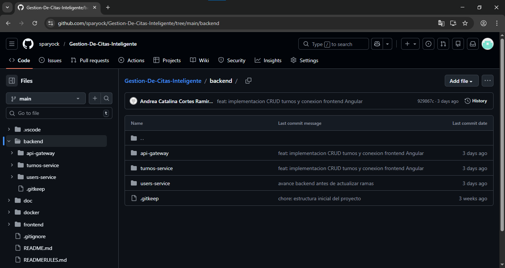
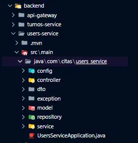
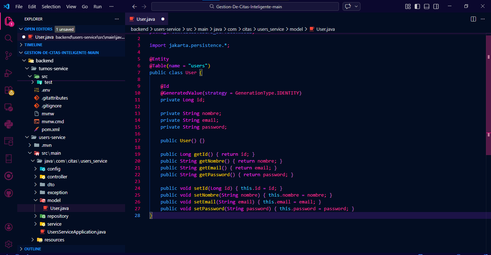
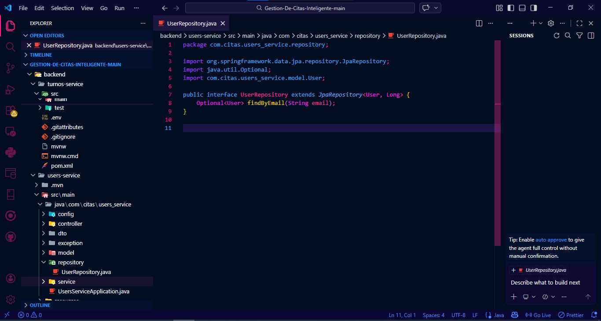
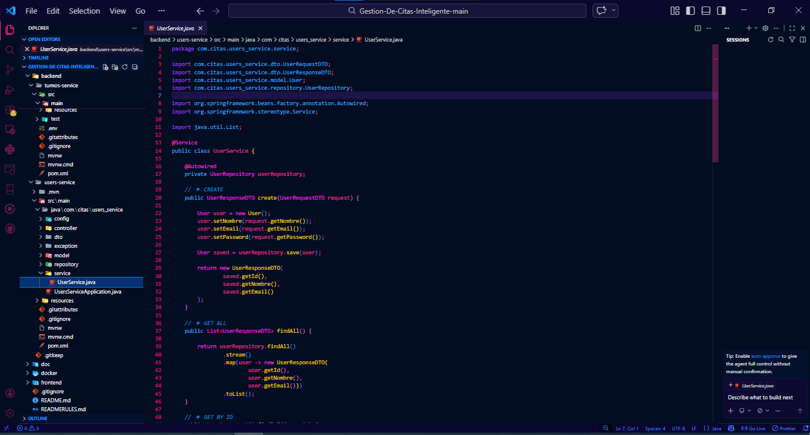
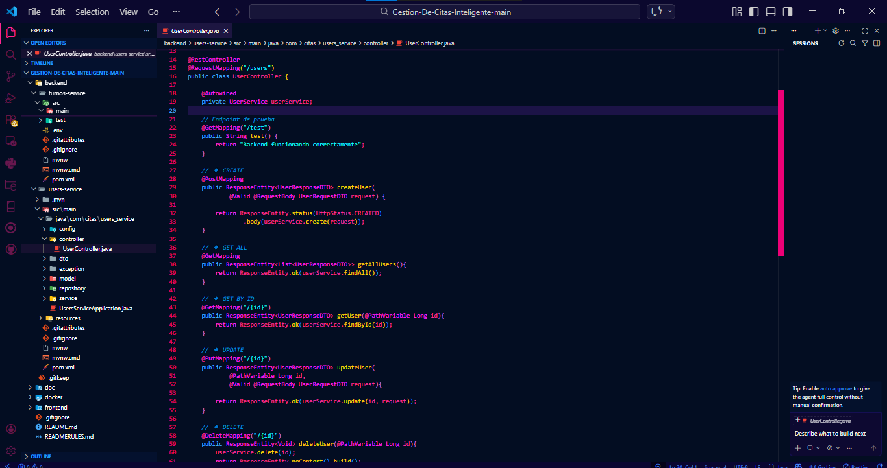
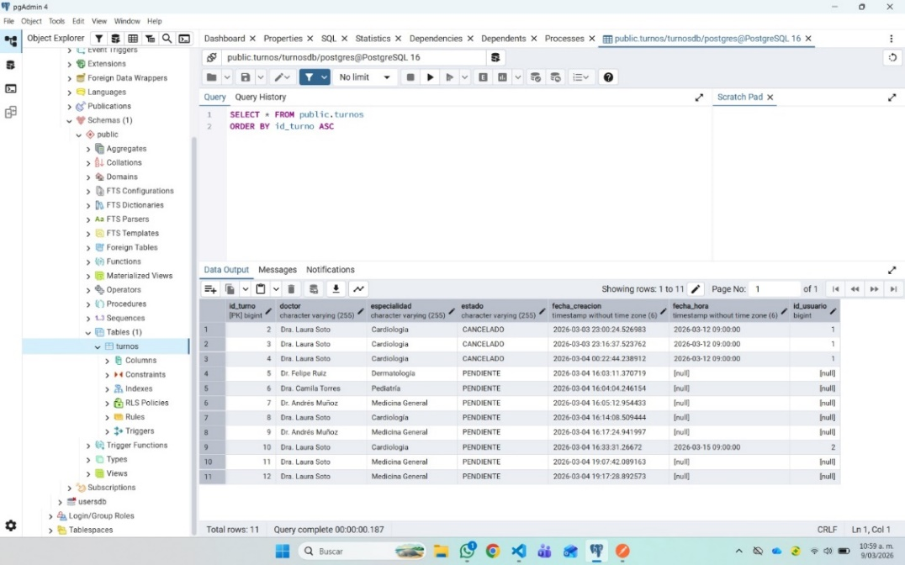
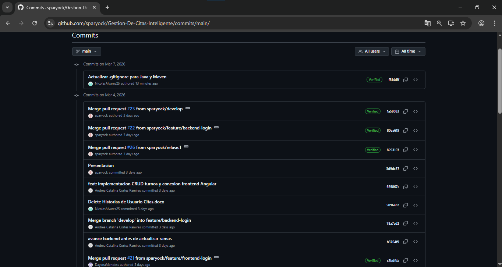
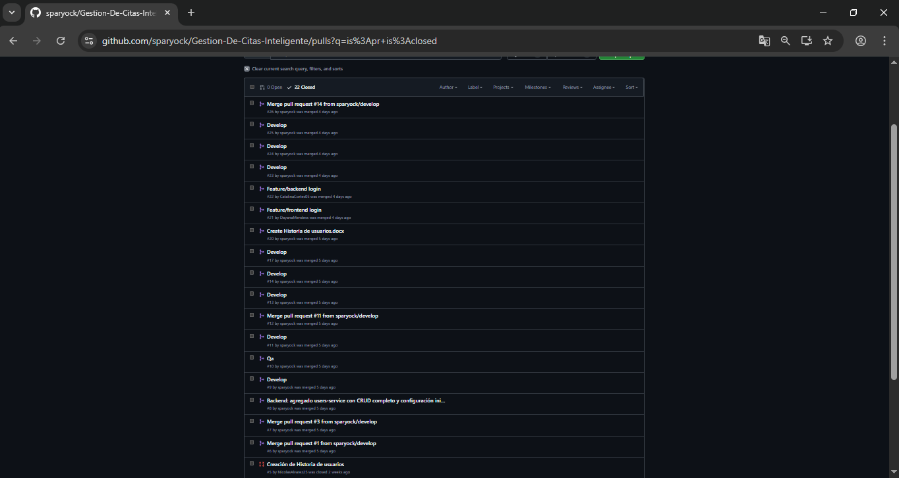
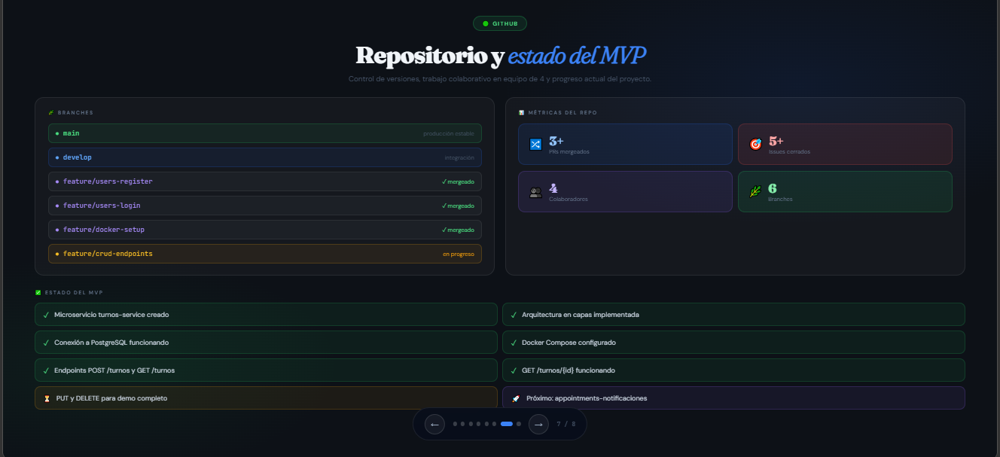

# Actividades — Semana 4, Sesión 1
## Sistemas Distribuidos — Desarrollo del Primer Microservicio

---

| Campo | Detalle |
|---|---|
| **Estudiante** | Nicolás Álvarez |
| **Asignatura** | Sistemas Distribuidos |
| **Institución** | CORHUILA |
| **Semana** | Semana 4, Sesión 1 — Desarrollo del Primer Microservicio |

---

## Actividad 1 — Crear el Microservicio Base

El microservicio base del proyecto ya está creado, configurado y subido al repositorio como parte del Release 1 — MVP. Se generó desde [start.spring.io](https://start.spring.io) y se ubicó en la carpeta `backend/user-service/` del monorepo.

### Configuración del proyecto

| Parámetro | Valor |
|---|---|
| Tipo de proyecto | Maven |
| Lenguaje | Java 17 |
| Spring Boot | 3.x |
| Group | co.edu.corhuila |
| Artifact | user-service |
| Puerto | 8081 |

### Dependencias incluidas en `pom.xml`

| Dependencia | Uso |
|---|---|
| `spring-boot-starter-web` | Exposición de endpoints REST |
| `spring-boot-starter-data-jpa` | Mapeo objeto-relacional con Hibernate |
| `postgresql` | Driver de conexión a PostgreSQL 16 |
| `lombok` | Reducción de código boilerplate (getters, setters, constructores) |
| `spring-boot-starter-validation` | Validación de datos en los DTOs |
| `spring-boot-starter-actuator` | Health checks y monitoreo |
| `spring-boot-starter-test` | Pruebas unitarias e integración |

### Estructura de paquetes implementada

```
backend/user-service/
└── src/
    └── main/
        ├── java/co/edu/corhuila/userservice/
        │   ├── UserServiceApplication.java       // Clase principal
        │   ├── controller/
        │   │   └── UserController.java           // Endpoints REST
        │   ├── service/
        │   │   ├── IUserService.java             // Interfaz del servicio
        │   │   └── UserServiceImpl.java          // Lógica de negocio
        │   ├── repository/
        │   │   └── IUserRepository.java          // Acceso a datos JPA
        │   ├── entity/
        │   │   └── User.java                     // Entidad JPA
        │   └── dto/
        │       ├── UserRequestDTO.java           // Datos de entrada
        │       └── UserResponseDTO.java          // Datos de salida
        └── resources/
            └── application.yml                   // Configuración
```

### Configuración del `application.yml`

```yaml
server:
  port: 8081

spring:
  application:
    name: user-service
  datasource:
    url: jdbc:postgresql://localhost:5432/usersdb
    username: postgres
    password: postgres
    driver-class-name: org.postgresql.Driver
  jpa:
    hibernate:
      ddl-auto: update
    show-sql: true
    properties:
      hibernate:
        format_sql: true
        dialect: org.hibernate.dialect.PostgreSQLDialect

management:
  endpoints:
    web:
      exposure:
        include: health,info
```

### Evidencia — Carpeta backend en el repositorio

Se muestra el contenido de la carpeta `backend/` en el monorepo, donde se encuentran los dos proyectos: `api-gateway` y `user-service`, cada uno con su estructura Maven independiente.

**Contenido de la carpeta backend**



---

## Actividad 2 — Implementar CRUD Completo

El CRUD completo del user-service está implementado con los 5 endpoints estándar, probados exitosamente con Postman y con datos persistidos en PostgreSQL 16.

### Arquitectura por capas

El microservicio sigue una arquitectura en tres capas bien definidas: Controller (presentación), Service (lógica de negocio) y Repository (acceso a datos). Cada capa tiene una única responsabilidad y se comunica con la siguiente a través de interfaces.

**Estructura de capas del microservicio de usuarios**



---

### Entidad principal: `User.java`

La entidad `User` está mapeada con JPA sobre la tabla `users` en PostgreSQL. Usa Lombok para reducir el boilerplate y `@PrePersist` / `@PreUpdate` para gestionar automáticamente las fechas de auditoría.

**Entidad User mapeada con JPA**



```java
@Entity
@Table(name = "users")
@Getter @Setter
@NoArgsConstructor @AllArgsConstructor
@Builder
public class User {

    @Id
    @GeneratedValue(strategy = GenerationType.IDENTITY)
    private Long id;

    @Column(nullable = false, length = 100)
    private String name;

    @Column(nullable = false, unique = true, length = 150)
    private String email;

    @Column(nullable = false)
    private String password;

    @Column(name = "created_at")
    private LocalDateTime createdAt;

    @Column(name = "updated_at")
    private LocalDateTime updatedAt;

    @PrePersist
    protected void onCreate() {
        this.createdAt = LocalDateTime.now();
        this.updatedAt = LocalDateTime.now();
    }

    @PreUpdate
    protected void onUpdate() {
        this.updatedAt = LocalDateTime.now();
    }
}
```

---

### Repository: `IUserRepository.java`

Spring Data JPA genera automáticamente la implementación de los métodos en tiempo de ejecución a partir del nombre del método — no es necesario escribir SQL manualmente.

**Interfaz UserRepository del microservicio de usuarios**



---

### Service: `UserServiceImpl.java`

La lógica de negocio está encapsulada en el servicio. Incluye validación de email duplicado y lanzamiento de excepción cuando no se encuentra un recurso por ID.

**Clase UserService del microservicio de usuarios**



---

### Controller: `UserController.java`

El controlador expone los 5 endpoints REST bajo el path `/api/v1/users` y delega toda la lógica al servicio.

**Clase UserController del microservicio de usuarios**



---

### Flujo de una petición REST

```
Cliente (Postman)
      |
  API Gateway (:8080)
      |
  UserController (:8081)
      |
  UserServiceImpl
      |
  IUserRepository
      |
  PostgreSQL (:5432) — tabla users
```

### Endpoints implementados y verificados

| Método | URL | Descripción | Código respuesta |
|---|---|---|---|
| GET | /api/v1/users | Listar todos los usuarios | 200 OK |
| GET | /api/v1/users/{id} | Obtener usuario por ID | 200 OK / 404 |
| POST | /api/v1/users | Crear un usuario | 201 Created |
| PUT | /api/v1/users/{id} | Actualizar un usuario | 200 OK / 404 |
| DELETE | /api/v1/users/{id} | Eliminar un usuario | 204 No Content |

### Evidencia — Endpoints probados en Postman

Las pruebas se realizaron a través del API Gateway en `http://localhost:8080`, confirmando que el enrutamiento hacia el user-service en el puerto 8081 funciona correctamente.

**Endpoint POST /turnos en Postman**


**Endpoint GET /turnos — respuesta 200 OK via Gateway**


**Datos persistidos en PostgreSQL — tabla turnos en pgAdmin**



---

## Actividad 3 — Commit y Pull Request

El código del user-service fue versionado siguiendo el flujo de ramas definido en la Semana 3: `feature/* → develop → qa → main`.

### Flujo de ramas utilizado

```
feature/SD-001-user-service-crud
        |
      develop
        |
        qa
        |
       main  ← Release 1 — MVP (v1.0.0, 3 de marzo de 2026)
```

### Convención de commits aplicada

| Commit | Descripción |
|---|---|
| `feat: add User entity with JPA mappings` | Creación de la entidad con anotaciones JPA y Lombok |
| `feat: add IUserRepository with custom queries` | Repositorio con métodos findByEmail y existsByEmail |
| `feat: implement UserServiceImpl with CRUD logic` | Lógica de negocio con manejo de excepciones |
| `feat: add UserController with REST endpoints` | Controlador con los 5 endpoints CRUD |
| `chore: configure application.yml for PostgreSQL` | Configuración de conexión a base de datos |

### Evidencia — Historial de commits en main

**Historial de commits en rama main**



---

### Evidencia — Pull Requests del proyecto

**Pull Requests del proyecto**



---

### Evidencia — Release 1 publicado

El código del user-service fue revisado, aprobado mediante Pull Request y mergeado a `main`. El Release 1 — MVP está publicado en GitHub con el tag `v1.0.0`, validando que el CRUD completo del microservicio de usuarios está funcional.

**Repositorio y estado del MVP presentado en la demo**



---

## Reflexión Final

**¿Por qué usamos interfaces para los servicios (IUserService) en lugar de clases directas?**

Porque permite desacoplar la definición del contrato (qué hace el servicio) de su implementación concreta (cómo lo hace). Esto facilita hacer pruebas unitarias con mocks, cambiar la implementación sin afectar el controlador, y sigue el principio SOLID de inversión de dependencias.

**¿Qué ventajas tiene JPA/Hibernate sobre escribir SQL manualmente?**

JPA elimina la necesidad de escribir SQL para operaciones CRUD estándar, mapea automáticamente las tablas de la base de datos a clases Java, y gestiona el ciclo de vida de las entidades. Con Spring Data JPA, métodos como `findByEmail` se generan automáticamente a partir del nombre del método, sin escribir ninguna consulta.

**¿Cómo se relaciona la estructura Controller → Service → Repository con SOLID?**

Cada capa tiene una única responsabilidad (Single Responsibility): el Controller solo maneja peticiones HTTP, el Service solo contiene lógica de negocio, y el Repository solo accede a datos. Las interfaces (IUserService, IUserRepository) aplican el principio de inversión de dependencias, permitiendo que cada capa dependa de abstracciones y no de implementaciones concretas.

---

## Referencias

- Walls, C. (2022). *Spring Boot in Action*. Manning Publications.
- Spring Boot Reference Documentation. (2024). https://docs.spring.io/spring-boot/docs/current/reference/html/
- Material de clase — Semana 4, Sesión 1: Desarrollo del Primer Microservicio. CORHUILA.
