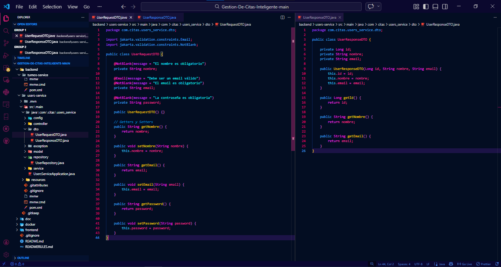
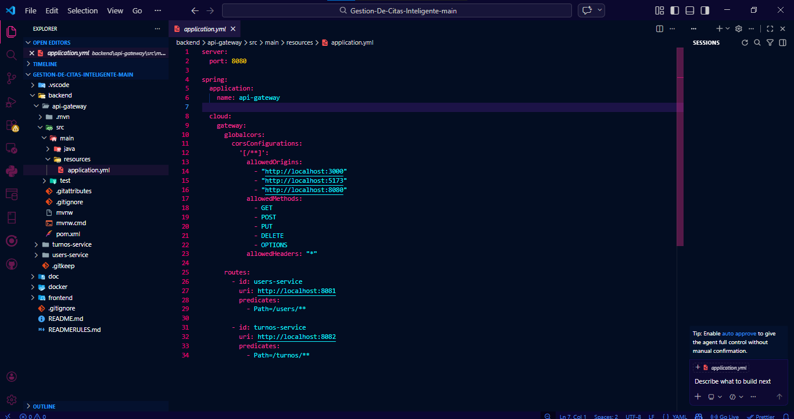
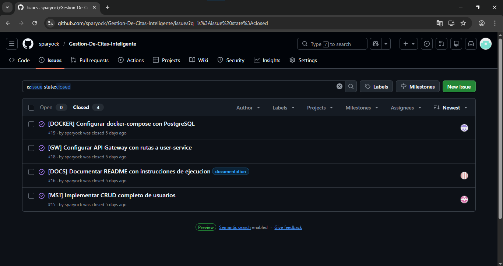

# Actividades — Semana 4, Sesión 2
## Sistemas Distribuidos — PostgreSQL y Persistencia en Microservicios

---

| Campo | Detalle |
|---|---|
| **Estudiante** | Nicolás Álvarez |
| **Asignatura** | Sistemas Distribuidos |
| **Institución** | CORHUILA |
| **Semana** | Semana 4, Sesión 2 — PostgreSQL y Persistencia en Microservicios |

---

## Actividad 1 — Levantar PostgreSQL con Docker

El proyecto ya tiene PostgreSQL configurado y funcionando mediante Docker Compose. El archivo `docker-compose.yml` se encuentra en la carpeta `docker/` del monorepo y levanta dos contenedores: PostgreSQL 16 y pgAdmin 4.

### Configuración del `docker-compose.yml`

```yaml
version: '3.8'

services:
  postgres-service-one:
    image: postgres:16-alpine
    container_name: postgres-service-one
    environment:
      POSTGRES_DB: serviceonedb
      POSTGRES_USER: postgres
      POSTGRES_PASSWORD: postgres
    ports:
      - "5432:5432"
    volumes:
      - pgdata-service-one:/var/lib/postgresql/data
    networks:
      - sd-network

  pgadmin:
    image: dpage/pgadmin4:latest
    container_name: pgadmin
    environment:
      PGADMIN_DEFAULT_EMAIL: admin@corhuila.edu.co
      PGADMIN_DEFAULT_PASSWORD: admin123
    ports:
      - "5050:80"
    networks:
      - sd-network

volumes:
  pgdata-service-one:

networks:
  sd-network:
    driver: bridge
```

### Comandos utilizados

```bash
# Levantar los contenedores en segundo plano
docker-compose up -d

# Verificar que ambos contenedores están corriendo
docker ps
```

### Acceso a los servicios

| Servicio | URL | Credenciales |
|---|---|---|
| pgAdmin | http://localhost:5050 | admin@corhuila.edu.co / admin123 |
| PostgreSQL | localhost:5432 | postgres / postgres |
| API Gateway | http://localhost:8080 | — |
| user-service | http://localhost:8081 | — |

### Verificación — Base de datos en pgAdmin

Al arrancar Spring Boot con `ddl-auto: update`, la tabla se crea automáticamente en PostgreSQL. La siguiente figura muestra la tabla `turnos` con 11 registros reales, confirmando que la persistencia funciona correctamente.

**Base de datos en pgAdmin — tabla turnos**


---

## Actividad 2 — Implementar 2+ Entidades con Relación

El proyecto implementa dos entidades relacionadas: `User` y `Turno`. La relación es `@ManyToOne` desde `Turno` hacia `User` — un usuario puede tener muchos turnos, pero cada turno pertenece a un único usuario.

### Relación entre entidades

```
User (1) ──────────── (N) Turno
  id                       id
  name                     idUsuario (FK)
  email                    especialidad
  password                 doctor
  createdAt                fechaHora
  updatedAt                estado
                           fechaCreacion
```

### Entidad `User.java` con `@OneToMany`

```java
@Entity
@Table(name = "users")
@Getter @Setter @NoArgsConstructor @AllArgsConstructor @Builder
public class User {

    @Id
    @GeneratedValue(strategy = GenerationType.IDENTITY)
    private Long id;

    @Column(nullable = false, length = 100)
    private String name;

    @Column(nullable = false, unique = true, length = 150)
    private String email;

    @Column(nullable = false)
    private String password;

    @OneToMany(mappedBy = "usuario", cascade = CascadeType.ALL)
    @JsonIgnore
    private List<Turno> turnos;

    @Column(name = "created_at")
    private LocalDateTime createdAt;

    @Column(name = "updated_at")
    private LocalDateTime updatedAt;

    @PrePersist
    protected void onCreate() {
        this.createdAt = LocalDateTime.now();
        this.updatedAt = LocalDateTime.now();
    }

    @PreUpdate
    protected void onUpdate() {
        this.updatedAt = LocalDateTime.now();
    }
}
```

### Entidad `Turno.java` con `@ManyToOne`

```java
@Entity
@Table(name = "turnos")
@Getter @Setter @NoArgsConstructor @AllArgsConstructor @Builder
public class Turno {

    @Id
    @GeneratedValue(strategy = GenerationType.IDENTITY)
    private Long id;

    @ManyToOne(fetch = FetchType.LAZY)
    @JoinColumn(name = "id_usuario")
    private User usuario;

    @Column(nullable = false)
    private String especialidad;

    @Column(nullable = false)
    private String doctor;

    @Column(name = "fecha_hora")
    private LocalDateTime fechaHora;

    @Column(nullable = false)
    private String estado;

    @Column(name = "fecha_creacion")
    private LocalDateTime fechaCreacion;

    @PrePersist
    protected void onCreate() {
        this.fechaCreacion = LocalDateTime.now();
        this.estado = "PENDIENTE";
    }
}
```

### DTOs implementados

Se utilizaron DTOs para el intercambio de datos entre capas, evitando exponer campos sensibles como `password` y desacoplando la API del modelo de base de datos.

**Clases UserRequestDTO y UserResponseDTO**



### Query Methods utilizados en los repositorios

```java
// IUserRepository
Optional<User> findByEmail(String email);
boolean existsByEmail(String email);

// ITurnoRepository
List<Turno> findByUsuarioId(Long userId);
List<Turno> findByEstado(String estado);
List<Turno> findByEspecialidad(String especialidad);
```

### Evidencia — Endpoints probados en Postman

**Endpoint POST /turnos en Postman**


**Endpoint GET /turnos — respuesta 200 OK via Gateway**


---

## Actividad 3 — Manejo de Errores y Validación

### GlobalExceptionHandler implementado

Se implementó un manejador global de excepciones con `@RestControllerAdvice` que intercepta los errores antes de que lleguen al cliente y retorna respuestas estructuradas con código HTTP, mensaje y timestamp.

```java
@RestControllerAdvice
public class GlobalExceptionHandler {

    @ExceptionHandler(ResourceNotFoundException.class)
    public ResponseEntity<Map<String, Object>> handleNotFound(
            ResourceNotFoundException ex) {
        return ResponseEntity.status(HttpStatus.NOT_FOUND).body(Map.of(
            "timestamp", LocalDateTime.now().toString(),
            "status", 404,
            "error", "Not Found",
            "message", ex.getMessage()
        ));
    }

    @ExceptionHandler(RuntimeException.class)
    public ResponseEntity<Map<String, Object>> handleRuntime(
            RuntimeException ex) {
        return ResponseEntity.status(HttpStatus.BAD_REQUEST).body(Map.of(
            "timestamp", LocalDateTime.now().toString(),
            "status", 400,
            "error", "Bad Request",
            "message", ex.getMessage()
        ));
    }
}
```

### Validaciones implementadas en los DTOs

```java
public record UserRequestDTO(

    @NotBlank(message = "El nombre es obligatorio")
    String name,

    @NotBlank
    @Email(message = "Debe ser un correo válido")
    String email,

    @NotBlank
    @Size(min = 6, message = "La contraseña debe tener al menos 6 caracteres")
    String password
) {}
```

### Tabla de respuestas de error

| Escenario | Código | Mensaje retornado |
|---|---|---|
| ID de usuario no encontrado | 404 Not Found | `User not found with id: X` |
| Email ya registrado | 400 Bad Request | `Email already exists: X` |
| Campo vacío o inválido | 400 Bad Request | Mensaje de la anotación de validación |
| Error inesperado en el servidor | 500 Internal Error | Mensaje genérico del servidor |

### Configuración del API Gateway

El API Gateway en el puerto 8080 enruta las peticiones hacia el user-service en el puerto 8081 y hacia el turno-service. Cualquier error retornado por los microservicios se propaga correctamente al cliente a través del Gateway.

**Configuración del API Gateway**



---

## Actividad 4 — Commit, PR y Merge

El código de persistencia fue versionado y mergeado a `main` siguiendo el flujo de ramas establecido. El Release 1 — MVP (`v1.0.0`) fue publicado el 3 de marzo de 2026 con toda la configuración de PostgreSQL, Docker Compose y los dos microservicios funcionando.

### Commits relacionados con persistencia

| Commit | Descripción |
|---|---|
| `feat(docker): add docker-compose with PostgreSQL and pgAdmin` | Configuración de contenedores de base de datos |
| `feat(user-service): add User entity with JPA and PostgreSQL config` | Entidad y conexión a BD |
| `feat(turno-service): add Turno entity with ManyToOne relation` | Segunda entidad con relación |
| `feat: add GlobalExceptionHandler and DTO validations` | Manejo de errores y validaciones |
| `chore: update README with execution instructions` | Instrucciones de ejecución actualizadas |

### Evidencia — Issues cerrados del proyecto

**Issues cerrados del proyecto en GitHub**



### Evidencia — Pull Requests del proyecto

**Pull Requests del proyecto**


---

## Referencias

- Momjian, B. (2001). *PostgreSQL: Introduction and Concepts*. Addison-Wesley.
- Spring Data JPA Documentation. (2024). https://docs.spring.io/spring-data/jpa/docs/current/reference/html/
- Material de clase — Semana 4, Sesión 2: PostgreSQL y Persistencia en Microservicios. CORHUILA.
