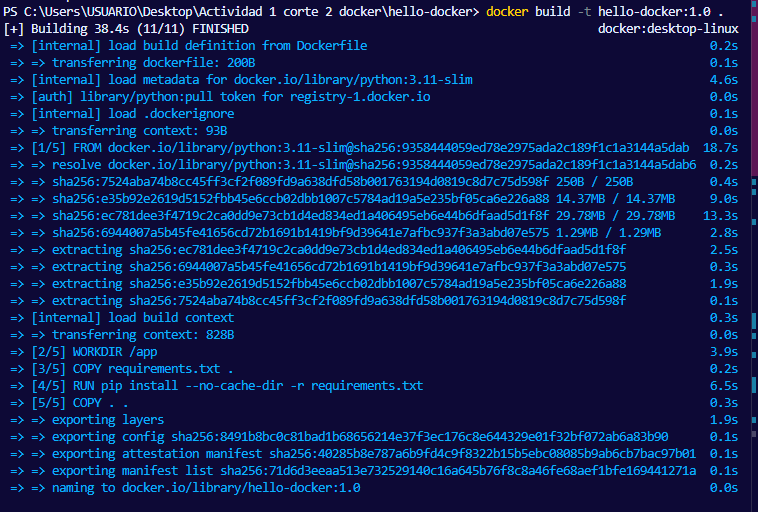
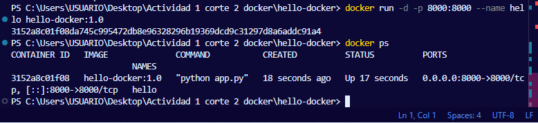
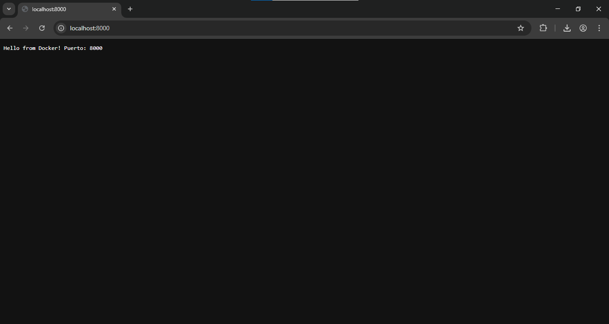
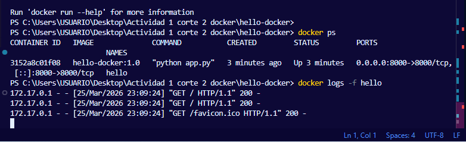

# 📦 Informe de Actividad Práctica
## Unidad 2 — Contenerización con Docker

---

| Campo | Detalle |
|---|---|
| **Estudiante** | Nicolas |
| **Asignatura** | Sistemas Distribuidos |
| **Institución** | CORHUILA |
| **Unidad** | Unidad 2 — Contenerización con Docker |

---

## 1. Introducción

La presente actividad práctica corresponde a la Unidad 2 del curso, cuyo objetivo es construir una imagen Docker funcional para una aplicación mínima en Python, ejecutarla mapeando puertos, variables de entorno y un volumen de datos.

Docker es una plataforma de contenerización que permite empaquetar aplicaciones junto con sus dependencias en contenedores ligeros y portables, garantizando consistencia entre entornos de desarrollo, pruebas y producción.

---

## 2. Estructura del Proyecto

Se creó la carpeta `hello-docker` con los siguientes archivos:

```
hello-docker/
├── app.py
├── requirements.txt
├── Dockerfile
└── .dockerignore
```

---

## 3. Descripción de los Archivos

### 3.1 `app.py`

Servidor HTTP simple que responde con un mensaje en texto plano. Lee el puerto desde la variable de entorno `PORT`; si no existe, usa `8000` por defecto.

```python
from http.server import BaseHTTPRequestHandler, HTTPServer
import os

PORT = int(os.getenv("PORT", "8000"))

class Handler(BaseHTTPRequestHandler):
    def do_GET(self):
        self.send_response(200)
        self.send_header("Content-type", "text/plain")
        self.end_headers()
        msg = f"Hello from Docker! Puerto: {PORT}"
        self.wfile.write(msg.encode())

HTTPServer(("", PORT), Handler).serve_forever()
```

### 3.2 `requirements.txt`

Contiene la librería `requests` como dependencia de prueba para verificar que el proceso de instalación de dependencias funciona correctamente dentro del contenedor.

```
requests==2.32.3
```

### 3.3 `.dockerignore`

Excluye archivos innecesarios del contexto de construcción, reduciendo el tamaño de la imagen y evitando incluir archivos sensibles.

```
__pycache__/
*.pyc
.env
.git
venv/
node_modules/
```

### 3.4 `Dockerfile`

Define la receta para construir la imagen. Se utiliza `python:3.11-slim` como imagen base para minimizar el tamaño. Se copia primero `requirements.txt` antes que el código para aprovechar el sistema de caché de capas de Docker.

```dockerfile
FROM python:3.11-slim
WORKDIR /app
COPY requirements.txt .
RUN pip install --no-cache-dir -r requirements.txt
COPY . .
EXPOSE 8000
CMD ["python", "app.py"]
```

---

## 4. Construcción y Ejecución de la Imagen

### 4.1 Construcción

Desde la carpeta `hello-docker` se ejecutó el siguiente comando:

```powershell
docker build -t hello-docker:1.0 .
```

Docker procesó cada instrucción del Dockerfile como una capa independiente. Al finalizar, confirmó la creación exitosa de la imagen con el mensaje `Successfully tagged hello-docker:1.0`.

#### Captura — `docker build`




---

### 4.2 Ejecución

Se ejecutó el contenedor en modo detached (`-d`), mapeando el puerto 8000 del host al puerto 8000 del contenedor:

```powershell
docker run -d -p 8000:8000 --name hello hello-docker:1.0
```

Para verificar que el contenedor estaba corriendo:

```powershell
docker ps
```

#### Captura — `docker run` y `docker ps`




---

### 4.3 Verificación en el navegador

Al acceder a `http://localhost:8000` desde el navegador, se mostró el mensaje esperado:

```
Hello from Docker! Puerto: 8000
```

#### Captura — Navegador `http://localhost:8000`




---

### 4.4 Logs del contenedor

```powershell
docker logs -f hello
```

#### Captura — `docker logs`




---

## 5. Variables de Entorno

La aplicación utiliza la variable de entorno `PORT` para determinar en qué puerto escuchar. Esto permite configurar el comportamiento del contenedor sin modificar el código fuente.

Se puede pasar la variable al momento de ejecutar el contenedor con la bandera `-e`:

```powershell
docker run -d -p 9000:9000 -e PORT=9000 --name hello hello-docker:1.0
```

En Python, la variable se lee con `os.getenv("PORT", "8000")`, donde el segundo argumento es el valor por defecto si la variable no está definida. Esta práctica es fundamental para aplicaciones que deben adaptarse a diferentes entornos sin requerir cambios en el código.

---

## 6. Persistencia de Datos con Bind Mount

Para probar la persistencia, se creó la carpeta `data/` en el host y se montó dentro del contenedor usando la opción `-v`:

```powershell
docker run -d -p 8000:8000 -v ${PWD}/data:/data --name hello hello-docker:1.0
```

Este mecanismo conecta la carpeta `data/` del sistema host con la carpeta `/data` dentro del contenedor. Cualquier archivo guardado en `/data` desde el contenedor persiste en el host incluso después de que el contenedor sea detenido o eliminado.

### Diferencia entre Volumen y Bind Mount

| Característica | Volumen | Bind Mount |
|---|---|---|
| Gestión | Gestionado por Docker | Carpeta del host |
| Uso recomendado | Bases de datos en producción | Desarrollo local |
| Portabilidad | Alta | Depende del sistema de archivos del host |

---

## 7. Inspección y Limpieza

Se utilizaron los siguientes comandos para inspeccionar el contenedor en ejecución:

```powershell
docker exec -it hello sh       # Abrir terminal dentro del contenedor
docker inspect hello           # Ver metadatos: red, mounts, variables
docker logs -f hello           # Ver logs en tiempo real
```

Al finalizar la actividad se realizó la limpieza de recursos:

```powershell
docker stop hello
docker rm hello
docker image prune
```

---

## 8. Aprendizajes y Conclusiones

- El `Dockerfile` es una receta declarativa que garantiza que el entorno sea reproducible en cualquier máquina.
- Copiar `requirements.txt` antes que el código fuente permite que Docker reutilice las capas cacheadas de las dependencias cuando solo cambia el código, acelerando los builds subsiguientes.
- Las variables de entorno son el mecanismo correcto para externalizar configuración sin hardcodear valores en el código ni en la imagen.
- Los bind mounts son útiles durante el desarrollo porque reflejan cambios del host dentro del contenedor sin necesidad de reconstruir la imagen.
- El flag `-d` (detached) permite correr contenedores en segundo plano, manteniendo libre la terminal.

En conclusión, Docker simplifica el proceso de desarrollo y despliegue al eliminar el problema de "en mi máquina funciona". La contenerización garantiza que la aplicación se comporta de la misma manera independientemente del entorno donde se ejecute.

---

## 9. Dificultades Encontradas

Durante la realización de la actividad no se presentaron dificultades técnicas significativas. El proceso de construcción y ejecución del contenedor se completó exitosamente siguiendo las instrucciones del material de apoyo de la Unidad 2.

---

## Referencias

- Docker Inc. (2024). *Get started with Docker*. https://docs.docker.com/get-started/
- Merkel, D. (2014). Docker: lightweight linux containers for consistent development and deployment. *Linux Journal*.
- Turnbull, J. (2019). *The Docker Book*. Turnbull Press.
