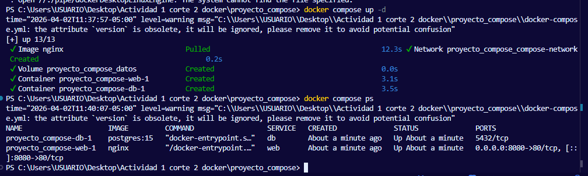
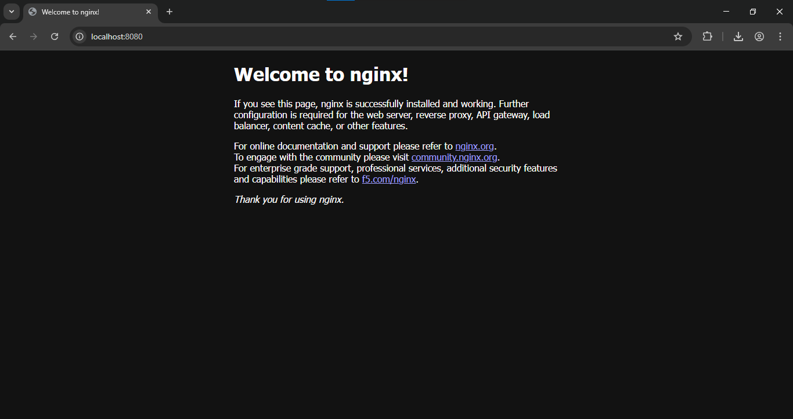
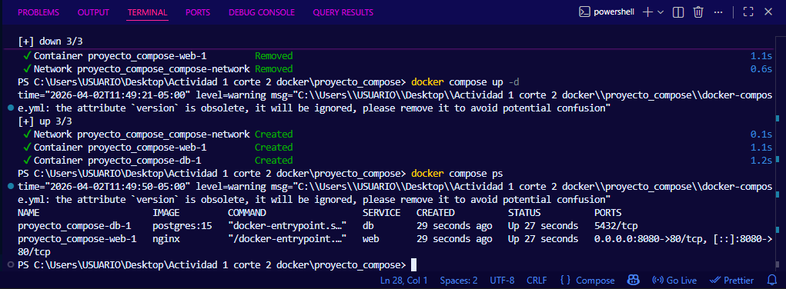

# Informe de Actividad Práctica
## Unidad 2 — Orquestación Básica con Docker Compose

---

| Campo | Detalle |
|---|---|
| **Estudiante** | Nicolás Álvarez |
| **Asignatura** | Sistemas Distribuidos |
| **Institución** | CORHUILA |
| **Unidad** | Unidad 2 — Docker Compose y Orquestación Básica |

---

## Introducción

Esta actividad práctica corresponde a la Unidad 2 del curso. El objetivo es configurar un archivo `docker-compose.yml` que defina una aplicación multicontenedor compuesta por un servidor web (Nginx) y una base de datos (PostgreSQL), validar su funcionamiento y comprobar la persistencia de datos mediante volúmenes.

Docker Compose permite levantar múltiples contenedores con un solo comando, definiendo toda la configuración en un único archivo YAML. Esto simplifica enormemente el proceso de desarrollo y reproducción de entornos.

---

## Estructura del Proyecto

Se creó la carpeta `proyecto_compose` con el siguiente contenido:

```
proyecto_compose/
└── docker-compose.yml
```

---

## Archivo `docker-compose.yml`

Se configuraron dos servicios, una red personalizada y un volumen para la persistencia de datos:

```yaml
services:
  web:
    image: nginx
    ports:
      - "8080:80"
    networks:
      - compose-network

  db:
    image: postgres:15
    environment:
      POSTGRES_USER: usuario
      POSTGRES_PASSWORD: contraseña123
      POSTGRES_DB: demodb
    volumes:
      - datos:/var/lib/postgresql/data
    networks:
      - compose-network

volumes:
  datos:

networks:
  compose-network:
    driver: bridge
```

### Descripción de cada sección

| Sección | Descripción |
|---|---|
| `web` | Contenedor con imagen Nginx expuesto en el puerto 8080 del host |
| `db` | Contenedor con PostgreSQL 15 con usuario, contraseña y base de datos configurados |
| `environment` | Variables de entorno que configuran la base de datos al iniciar |
| `volumes` | Monta el volumen `datos` en la carpeta de datos de PostgreSQL para persistencia |
| `networks` | Red personalizada que permite la comunicación entre los dos servicios por nombre |

---

## Ejecución

### Levantar los servicios

Se ejecutó el siguiente comando desde la carpeta `proyecto_compose`:

```powershell
docker compose up -d
```

El flag `-d` indica modo detached (en segundo plano). Docker descargó las imágenes y creó los contenedores automáticamente.

### Verificar que los servicios están corriendo

```powershell
docker compose ps
```

#### Captura — `docker compose ps` (servicios corriendo)



Los dos servicios aparecen con estado `Up`:
- `proyecto_compose-web-1` → Nginx corriendo en `0.0.0.0:8080->80/tcp`
- `proyecto_compose-db-1` → PostgreSQL corriendo en el puerto `5432/tcp`

---

## Verificación en el Navegador

Se accedió a `http://localhost:8080` para confirmar que el servidor Nginx estaba respondiendo correctamente.

#### Captura — Nginx en `http://localhost:8080`



La página de bienvenida de Nginx confirmó que el servicio web estaba funcionando correctamente dentro del contenedor.

---

## Persistencia de Datos con Volumen

Para validar que el volumen `datos` mantiene la información de la base de datos entre reinicios, se ejecutó la siguiente secuencia:

```powershell
docker compose down
docker compose up -d
docker compose ps
```

`docker compose down` eliminó los contenedores y la red, pero **no el volumen**. Al volver a levantar los servicios con `docker compose up -d`, PostgreSQL encontró los datos existentes en el volumen y los cargó sin necesidad de reinicializar la base de datos.

#### Captura — `docker compose ps` después del reinicio



Los dos contenedores volvieron a levantarse correctamente con los datos persistidos en el volumen `datos`.

---

## Reflexión — Ventajas de Docker Compose

El uso de Docker Compose frente a ejecutar contenedores individuales con `docker run` ofrece varias ventajas importantes:

**Simplicidad:** Con un solo comando (`docker compose up`) se levanta todo el entorno completo. Sin Compose, habría que ejecutar un `docker run` por cada contenedor con todos sus parámetros.

**Reproducibilidad:** El archivo `docker-compose.yml` describe el entorno de forma exacta. Cualquier desarrollador del equipo puede clonar el repositorio y levantar el mismo entorno sin configuración adicional.

**Comunicación entre servicios:** Los servicios se comunican entre sí usando el nombre del servicio como hostname (por ejemplo, `db`), sin necesidad de conocer IPs ni puertos internos.

**Gestión de volúmenes y redes:** Compose crea y gestiona automáticamente los volúmenes y redes definidos, eliminando la necesidad de crearlos manualmente.

**Colaboración:** Al versionar el `docker-compose.yml` en Git, todo el equipo trabaja con exactamente el mismo entorno, eliminando el problema de "en mi máquina funciona".

---

## Referencias

- Docker Inc. (2024). *Docker Compose documentation*. https://docs.docker.com/compose
- Turnbull, J. (2019). *The Docker Book*. Turnbull Press.
