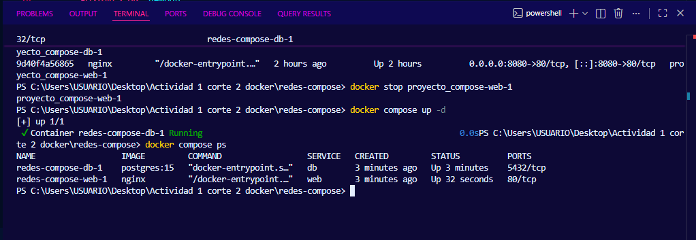
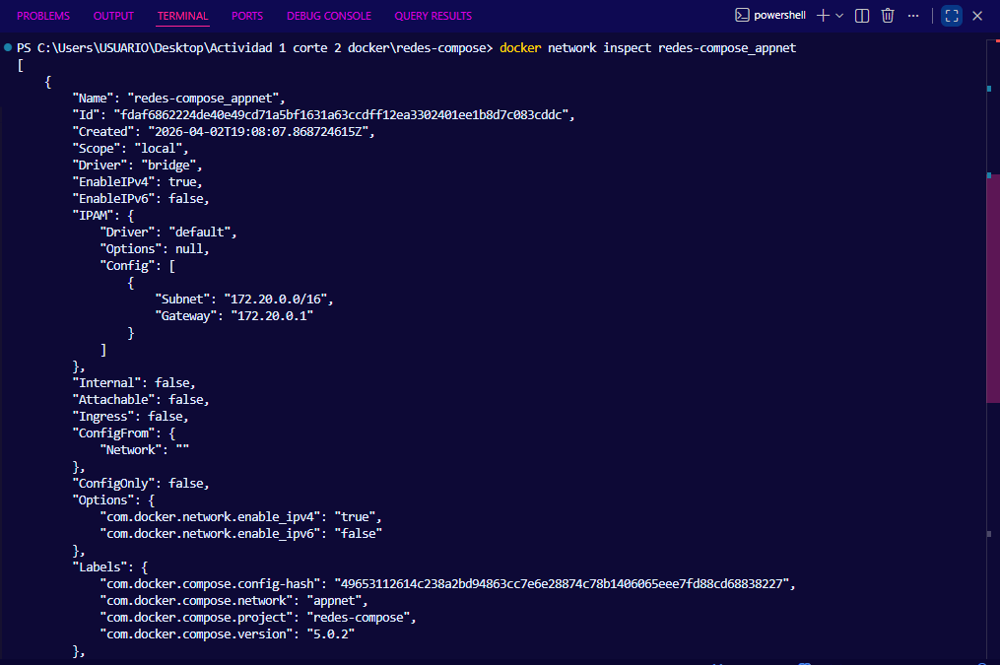

# Informe de Actividad Práctica
## Unidad 2 — Redes y Comunicación entre Servicios

---

| Campo | Detalle |
|---|---|
| **Estudiante** | Nicolás Álvarez |
| **Asignatura** | Sistemas Distribuidos |
| **Institución** | CORHUILA |
| **Unidad** | Unidad 2 — Redes y Comunicación entre Servicios |

---

## Introducción

Esta actividad práctica corresponde a la Unidad 2 del curso. El objetivo es configurar una red personalizada en Docker Compose para que dos servicios (web y base de datos) se comuniquen de forma interna usando el nombre del servicio como hostname, sin necesidad de exponer puertos innecesarios al host.

En sistemas distribuidos, los servicios deben comunicarse entre sí de forma segura y confiable. Docker provee mecanismos de redes virtuales para lograrlo sin configuraciones manuales complejas.

---

## Estructura del Proyecto

Se creó la carpeta `redes-compose` con el siguiente contenido:

```
redes-compose/
└── docker-compose.yml
```

---

## Archivo `docker-compose.yml`

Se configuraron dos servicios conectados a una red personalizada llamada `appnet`:

```yaml
services:
  web:
    image: nginx
    ports:
      - "8080:80"
    networks:
      - appnet

  db:
    image: postgres:15
    environment:
      POSTGRES_USER: usuario
      POSTGRES_PASSWORD: 123n
      POSTGRES_DB: demodb
    networks:
      - appnet

networks:
  appnet:
    driver: bridge
```

### Descripción de cada sección

| Sección | Descripción |
|---|---|
| `web` | Contenedor Nginx expuesto en el puerto 8080 del host, conectado a `appnet` |
| `db` | Contenedor PostgreSQL 15 con credenciales configuradas, conectado a `appnet` |
| `appnet` | Red personalizada tipo bridge que permite la comunicación interna entre servicios |

La diferencia clave frente a la actividad anterior es que aquí **no se expone el puerto de la base de datos al host**. PostgreSQL solo es accesible desde dentro de la red `appnet`, lo que es una buena práctica de seguridad.

---

## Ejecución

Se levantaron los servicios con:

```powershell
docker compose up -d
```

Docker creó la red `appnet`, el contenedor `web` y el contenedor `db` de forma automática.

### Verificación con `docker compose ps`

```powershell
docker compose ps
```

#### Captura — Servicios corriendo



Los dos servicios aparecen con estado `Up`:
- `redes-compose-web-1` → Nginx en `0.0.0.0:8080->80/tcp`
- `redes-compose-db-1` → PostgreSQL en `5432/tcp` (solo interno, no expuesto al host)

---

## Inspección de la Red

Se inspeccionó la red `appnet` para verificar su configuración y los contenedores conectados:

```powershell
docker network inspect redes-compose_appnet
```

#### Captura — Primera inspección (solo db conectado)



En la primera ejecución solo aparecía `db` conectado a la red porque el contenedor `web` tuvo un problema al levantarse por un conflicto de puerto con una actividad anterior. Se reinició todo con `docker compose down` y `docker compose up -d`.

#### Captura — Segunda inspección (ambos contenedores conectados)


Tras el reinicio, la red `appnet` muestra los dos contenedores conectados con sus IPs asignadas:

| Contenedor | IP asignada |
|---|---|
| `redes-compose-web-1` | `172.20.0.2` |
| `redes-compose-db-1` | `172.20.0.3` |

La subred utilizada es `172.20.0.0/16` con gateway en `172.20.0.1`.

---

## Validación de Comunicación entre Servicios

Se verificó que el servicio `web` puede resolver y conectarse al servicio `db` usando su nombre como hostname:

```powershell
docker exec -it redes-compose-web-1 curl http://db:5432
```

#### Captura — Comunicación exitosa entre servicios


La respuesta `curl: (52) Empty reply from server` confirma que la comunicación fue exitosa. El contenedor `web` resolvió correctamente el nombre `db` y se conectó a su puerto 5432. La respuesta vacía es esperada porque PostgreSQL no habla HTTP — lo importante es que el nombre fue resuelto y la conexión se estableció.

---

## Verificación en el Navegador

Se accedió a `http://localhost:8080` para confirmar que Nginx estaba respondiendo correctamente.

#### Captura — Nginx en `http://localhost:8080`


La página de bienvenida de Nginx confirmó que el servicio web estaba funcionando correctamente.

---

## Limpieza

Al finalizar la actividad se detuvieron y eliminaron los contenedores y la red:

```powershell
docker compose down
```

Docker eliminó los contenedores y la red `appnet` automáticamente.

---

## Explicación de la Comunicación entre Servicios

Cuando dos servicios están en la misma red de Docker Compose, Docker actúa como un DNS interno. Cada contenedor puede encontrar a los demás usando el nombre del servicio como hostname, sin necesidad de conocer IPs ni puertos internos.

En este caso, `web` puede conectarse a `db` simplemente usando `db` como dirección. Docker resuelve ese nombre a la IP interna del contenedor (`172.20.0.3`). Esto es posible gracias a la red `appnet` de tipo bridge que comparten ambos servicios.

Las ventajas de este enfoque son:

- La base de datos no está expuesta al exterior, solo es accesible desde dentro de la red
- Si la IP del contenedor cambia, el nombre `db` sigue funcionando
- Es la misma estrategia que se usa en el proyecto Gestión de Citas Inteligente para la comunicación entre microservicios

---

## Referencias

- Docker Inc. (2024). *Docker networking documentation*. https://docs.docker.com/network/
- Turnbull, J. (2019). *The Docker Book*. Turnbull Press.
