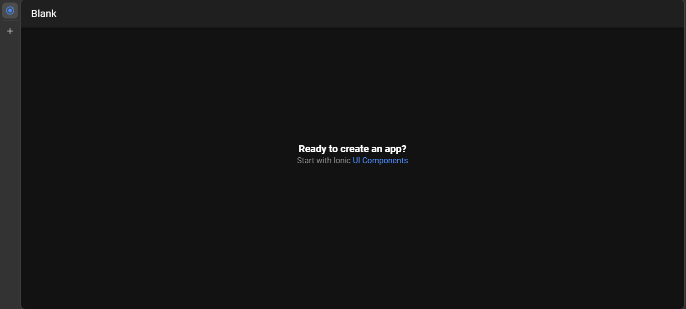
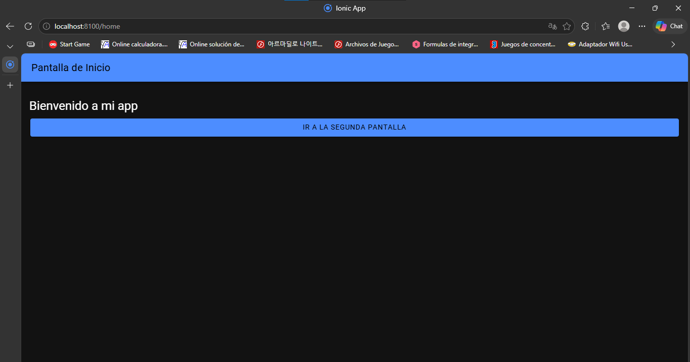
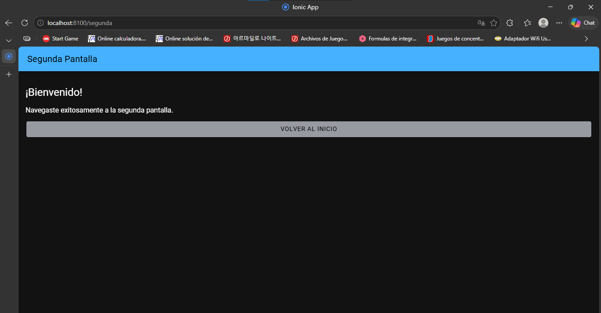

# Actividad Práctica — Tema 4: Frameworks Móviles Híbridos
## Unidad 2 — Desarrollo Móvil

---

| Campo | Detalle |
|---|---|
| **Estudiante** | Nicolás Álvarez |
| **Asignatura** | Sistemas Distribuidos |
| **Institución** | CORHUILA |
| **Tema** | Tema 4 — Frameworks móviles híbridos |

---

## Cuadro Comparativo — Flutter vs Ionic vs React Native

| Criterio | Flutter | Ionic | React Native |
|---|---|---|---|
| **Lenguaje principal** | Dart | JavaScript / TypeScript (Angular, React, Vue) | JavaScript / TypeScript |
| **Arquitectura base** | Motor gráfico propio (Skia), árbol de widgets | Tecnologías web empaquetadas con Capacitor | Puente JS que conecta con componentes nativos |
| **Ventajas clave** | UI uniforme en todas las plataformas, alto rendimiento, hot reload | Curva de aprendizaje rápida para desarrolladores web, multiplataforma | Gran comunidad, soporte empresarial fuerte, ecosistema maduro |
| **Limitaciones** | Ecosistema aún en crecimiento, Dart es poco conocido | Menor rendimiento en apps con animaciones o gráficos complejos | Puede requerir módulos nativos para funcionalidades específicas |
| **Plataformas** | Android, iOS, Web, Desktop | Android, iOS, Web | Android, iOS |
| **Ejemplos reales** | Nubank, eBay Motors | MarketWatch | Instagram, Uber Eats |

---

## Ejercicio Práctico — Proyecto en Ionic

Se seleccionó **Ionic** como framework para el ejercicio práctico, por su compatibilidad con tecnologías web estándar (HTML, TypeScript, Angular) y su capacidad de ejecutarse directamente en el navegador sin necesidad de emulador.

### Herramientas utilizadas

| Herramienta | Versión |
|---|---|
| Node.js | Instalado previamente |
| Ionic CLI | Última versión estable |
| Angular | Standalone Components |
| Navegador | Chrome / Edge |

### Comandos ejecutados

```bash
# Instalar el CLI de Ionic
npm install -g @ionic/cli

# Crear el proyecto
ionic start mi-app blank --type=angular

# Entrar a la carpeta
cd mi-app

# Generar la segunda página
ionic generate page segunda

# Levantar el servidor de desarrollo
ionic serve
```

### Código — `home.page.ts`

```typescript
import { Component } from '@angular/core';
import { RouterLink } from '@angular/router';
import { IonHeader, IonToolbar, IonTitle, IonContent, IonButton } from '@ionic/angular/standalone';

@Component({
  selector: 'app-home',
  templateUrl: 'home.page.html',
  standalone: true,
  imports: [IonHeader, IonToolbar, IonTitle, IonContent, IonButton, RouterLink],
})
export class HomePage {}
```

### Código — `home.page.html`

```html
<ion-header>
  <ion-toolbar color="primary">
    <ion-title>Pantalla de Inicio</ion-title>
  </ion-toolbar>
</ion-header>

<ion-content class="ion-padding">
  <h2>Bienvenido a mi app</h2>
  <ion-button expand="block" routerLink="/segunda">
    Ir a la segunda pantalla
  </ion-button>
</ion-content>
```

### Código — `segunda.page.ts`

```typescript
import { Component } from '@angular/core';
import { RouterLink } from '@angular/router';
import { IonHeader, IonToolbar, IonTitle, IonContent, IonButton } from '@ionic/angular/standalone';

@Component({
  selector: 'app-segunda',
  templateUrl: './segunda.page.html',
  standalone: true,
  imports: [IonHeader, IonToolbar, IonTitle, IonContent, IonButton, RouterLink],
})
export class SegundaPage {}
```

### Código — `segunda.page.html`

```html
<ion-header>
  <ion-toolbar color="secondary">
    <ion-title>Segunda Pantalla</ion-title>
  </ion-toolbar>
</ion-header>

<ion-content class="ion-padding">
  <h2>¡Bienvenido!</h2>
  <p>Navegaste exitosamente a la segunda pantalla.</p>
  <ion-button expand="block" routerLink="/home" color="medium">
    Volver al inicio
  </ion-button>
</ion-content>
```

### Evidencia — App corriendo en el navegador

**Proyecto Ionic ejecutándose por primera vez**



**Pantalla de inicio con título y botón**



**Segunda pantalla después de presionar el botón**



---

## Criterios de Selección del Framework

### Proyecto pequeño de uso interno (app universitaria)

Para un proyecto pequeño como una app para un grupo de trabajo universitario, la elección más adecuada sería **Ionic**. Su curva de aprendizaje es muy baja para desarrolladores que ya conocen HTML, CSS y JavaScript o TypeScript, lo que permite construir una app funcional en poco tiempo sin necesidad de aprender un lenguaje nuevo. Al ejecutarse en el navegador y en dispositivos móviles sin configuraciones complejas, reduce el tiempo de desarrollo y no requiere un presupuesto alto. Además, para una app de uso interno con interfaces simples, el rendimiento de Ionic es completamente suficiente.

### Proyecto mediano con necesidad de escalabilidad (app comercial local)

Para un proyecto mediano con requerimientos de escalabilidad, como una app comercial para un negocio local, la opción más adecuada sería **React Native**. Su ecosistema maduro y su amplia comunidad garantizan soporte a largo plazo y disponibilidad de librerías para prácticamente cualquier funcionalidad. La posibilidad de compartir lógica de negocio entre iOS y Android reduce costos de mantenimiento, y su soporte empresarial respaldado por Meta lo convierte en una apuesta segura para proyectos que deben crecer con el tiempo. La curva de aprendizaje es moderada para desarrolladores con experiencia en JavaScript, lo que lo hace viable en términos de tiempo y presupuesto.

---

## Referencias

- Google Developers. (2024). *Flutter Documentation*. https://docs.flutter.dev
- Ionic Framework. (2024). *Ionic Docs*. https://ionicframework.com/docs
- Meta. (2024). *React Native Documentation*. https://reactnative.dev/docs/getting-started
- Singh, V. (2022). *Mobile App Development with Flutter, React Native, and Ionic*.
- Material de clase — Tema 4: Frameworks móviles híbridos. CORHUILA.
